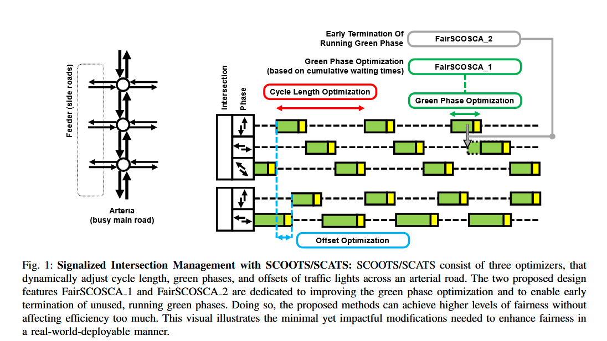

# FairSCOSCA: Fairness At Arterial Signals - Just Around The Corner

## Introduction 

This is the online repository of **"FairSCOSCA: Fairness At Arterial Signals - Just Around The Corner"** (submitted to the 105th Annual Meeting of the Transportation Research Board (TRB 2026) in Washington DC, USA). 
This repository contains a Python-implementation of the proposed FairSCOSCA algorithm for fairness-enhancing, coordinated, signalized intersection management (traffic lights), as an adaptation to SCOOTS/SCATS.
The repository is based on [SUMO (provided by DLR)](https://eclipse.dev/sumo/).

## Abstract
Traffic congestion in urban areas leads to significant externalities—including time loss, emissions, fuel waste, noise pollution, and psychological stress—undermining quality of life and public health.
Traffic signal control at intersections, especially in arterial networks, is a key lever for mitigating these effects. 
However, widely adopted systems like SCOOTS and SCATS traditionally prioritize efficiency, often resulting in unfair outcomes for certain road users. 
This paper introduces FairSCOSCA, a fairness-enhancing extension to these systems, featuring two novel yet practical design adaptations: (1) green phase optimization incorporating cumulative waiting times, and (2) early termination of underutilized green phases. 
Evaluated in a calibrated microsimulation of the arterial network in Esslingen am Neckar, Germany, FairSCOSCA demonstrates substantial improvements across multiple fairness dimensions—Egalitarian, Rawlsian, Utilitarian, and Harsanyian—without sacrificing traffic efficiency. 
Compared against Fixed-Cycle, Max-Pressure, and standard SCOOTS/SCATS controllers, FairSCOSCA significantly reduces delay inequality and horizontal discrimination between arterial and feeder roads. 
The open-source implementation emphasizes real-world feasibility. 
This work contributes to the growing literature on equitable traffic control by bridging the gap between fairness theory and the practical enhancement of globally deployed signal systems.



## ⿺ Benchmark Controller Parameter

In this case study four different traffic light controllers were compared:
- Pretimed, Fixed-Cycle Controller
- Max-Pressure Controller
- SCOOTS/SCATS (SCOSCA)
- FairSCOSCA_1
- FairSCOSCA_2

The parameters for each control algorithm were determined using Bayesian optimization, with the objective of minimizing the average delay across the network.
Following tables summarize the parameters obtained for SCOSCA, FairSCOSCA_1 and FairSCOSCA_2.

### SCOOTS/SCATS (SCOSCA)
|**Parameter**|**Symbol**|**Value**|
|--|--|--|
| Green phase adjustment factor | $\lambda_1$  | 6.62 |
| Cycle length adjustment factor | $\lambda_2$ | 46.71 |
| Offset adjustment factor | $\lambda_3$ | 0.24 |
| Green phase threshold | $\tau_1$ | 0.79 |
| Offset threshold | $\tau_2$ | 0.14 |

### FairSCOSCA_1
|**Parameter**|**Symbol**|**Value**|
|--|--|--|
| Green phase adjustment factor | $\lambda_1$  | 14.99 |
| Cycle length adjustment factor | $\lambda_2$ | 28.66 |
| Offset adjustment factor | $\lambda_3$ | 0.32 |
| Green phase threshold | $\tau_1$ | 2.41 |
| Offset threshold | $\tau_2$ | 0.47 |
| Alpha | $\alpha$ | 0.62 |

### FairSCOSCA_2
|**Parameter**|**Symbol**|**Value**|
|--|--|--|
| Green phase adjustment factor | $\lambda_1$  | 10.59 |
| Cycle length adjustment factor | $\lambda_2$ | 10.36 | 
| Offset adjustment factor | $\lambda_3$ | 0.32 |
| Green phase threshold | $\tau_1$ | 0.10 |
| Offset threshold | $\tau_2$ | 0.11 |
| Time To Green | $\texttt{TTG}$ | 54.96 |
| Time Earlier Green | $\texttt{TEG}$ | 2.36 |


## 📁 What you will find in this repository
This repository contains the miroscopic traffic simulation model, data, and source code to reproduce the findings of our study. 
The folder contain following information:
```
./
├── code/
│   ├── figures/...
│   ├── ControllerFairSCOSCA_1.py
│   ├── ControllerFairSCOSCA_2.py
│   ├── ControllerMaxPressure.py
│   ├── ControllerSCOSCA.py
│   ├── Optimizer.py
│   ├── RunSimulation.py
│   └── Utils.py
├── figures/
│   └── ...
├── model/
│   ├── Configuration.sumocfg
│   ├── Network.net.xml
│   ├── CarRoutes.rou.xml
│   ├── BusRoutes.rou.xml
│   ├── BusStops.add.xml
│   └── ...
└── logs/
│   ├── FIXED_CYCLE/...
│   ├── MAX_PRESSURE/...
│   ├── SCOSCA/...
│   ├── SCOSCAFAIRV1/...
    └── SCOSCAFAIRV2/...
```

## ⚛ Simulation Model
The microscopic traffic simulation model consists of five intersections of the arterial network "Schorndorfer Strasse" in Esslingen am Neckar (Germany); the demand model was was calibrated based on real-world loop-detector data. 
The simulation includes bus, cars, trucks, and motorcycle traffic.
Public transport is spawned according to the schedule, and visits bus stops.


## 📖 Logs

For each controller and seed (41-60), three log files are captured from the microsimulations.

| **Log_File** | **Description** |
|--|--|
| *Log_summary.xml* | Includes traffic flow dynamics such as flow, speed, density for every 5 minutes (300s) of the simulation. This is especially useful for the efficiency analysis. |
| *Output.txt* | Logged statistics based on the Simulation software, including summary statistics for both - fairness and efficiency. |
| *TripInfos.xml* | Detailed information about every single trip of the simulation, which helps to assess distributions of delays for the equity analysis. |

## 💡 Code

The simulation can be launched with `Run_Simulation.py`, and offers five different control modes: 
- FIXED_CYCLE
- MAX_PRESSURE
- SCOSCA
- SCOSCAFAIRV1
- SCOSCAFAIRV2

After the run of a simulation, the log files appear in the folder `model/logs/` for reference.

An automated optimization of parameters can be achieved with the file `Optimizer.py`.

Further scripts to generate the tables and results from the paper can be found in `code/figures/`.

The software is developed in Python and using SUMO traffic simulator. Following software packages are required for a successfull run (the ones listed in `requirements.txt`):
```
python==3.12.5
traci==1.22.0
eclipse-sumo==1.22.0
pandas==2.2.3
numpy==2.2.2
bayes_opt
matplotlib==3.8.3
seaborn==0.12.2
```

## 📄 Citation
If you found this repository helpful, please cite our work:
```
Kevin Riehl, Justin Weiss, Anastasios Kouvelas, Michail A. Makridis
"FairSCOSCA: Fairness At Arterial Signals - Just Around The Corner"
Submitted to 105th Annual Meeting of the Transportation Research Board (TRB 2026), Washington, DC, USA, January 11-15, 2025.
```
